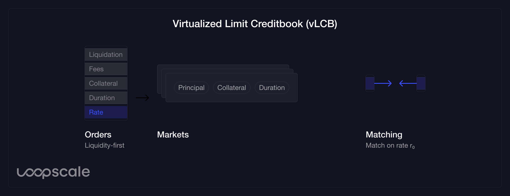

# Credit Order Book

TODO: Fix all of this. in particular, figure out how to get the names to be similar

The Credit Order Book (COB) serves as the central venue where lenders and borrowers interact via offers and requests. It is designed to facilitate efficient order matching, price discovery, and liquidity concentration. The Limit Creditbook (LCB) catalogs all borrower and lender orders and the virtualized Limit Creditbooks (vLCB) represents an abstraction designed to concentrate liquidity for a subset of markets.

## Smart Orders
Lenders may create Smart Orders, which enhance capital efficiency by enabling the same capital to be displayed as multiple different Lend Limit Orders according to a term ruleset:
- Eligible collateral and maximum LTVs
- Rate on a per-collateral-duration pair basis
- Eligible durations

## Virtual Markets
Virtual Markets are standardized subsets of terms with fixed oracles, fees, and zero-coupon repayment schedules. These Virtual Markets offer a preset selection of duration, collateral, and principal options.

On the Credit Order Book, borrowers and lenders can place orders for by defining individual [loan structures](/concepts/protocol-concepts/loans) offering maximal configurability. On Loopscale, borrowers and lenders primarily interact with the Credit Order Book via virtualized Credit Order Books. A virtualized Credit Order Book represents a collection of orders standardized on a subset of terms.
The initial virtualized credit books on Loopscale standardize orders such that borrowers and lenders specify only principal, collateral, amount, rate, and duration and principal, collateral, and duration have a predefined set of options. This provides a streamlined experience and concentrates liquidity within unique combinations of principal, collateral, and duration.

As liquidity grows, more vLCBs will be introduced with finer parameterization, balancing the trade-off between liquidity concentration and flexibility.

## Order Matching
The Creditbook employs an on-chain matching engine to pair loan offers with loan requests. If an offer and request match across loan terms, the borrower may fill the lender offer, initialized the loan.

Borrowers may also fill lender offers directly with matching collateral without creating a request. In this case, the borrower will fill the best-available order on the LCB as determined by the interest rate.

