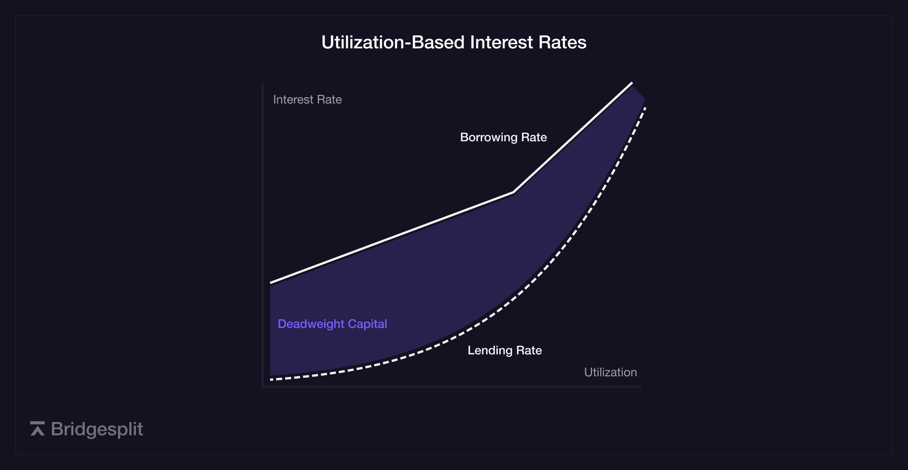
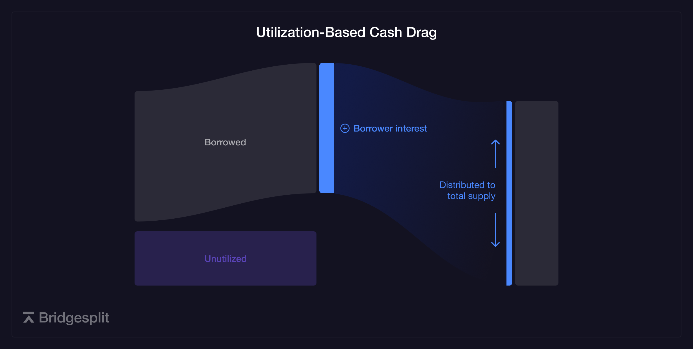
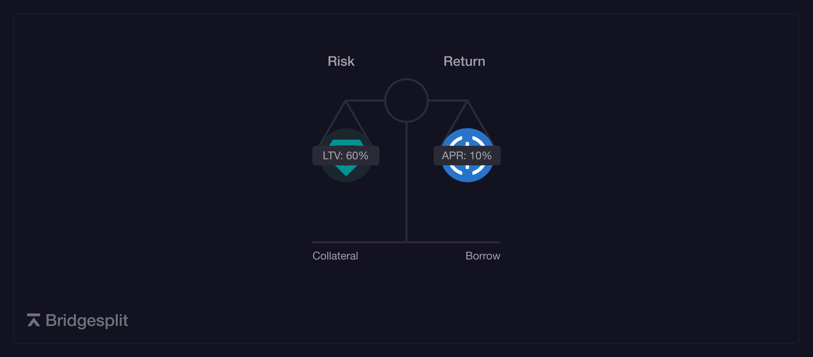
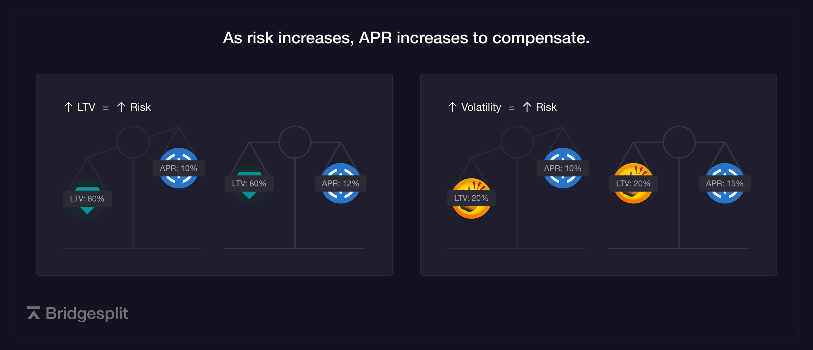
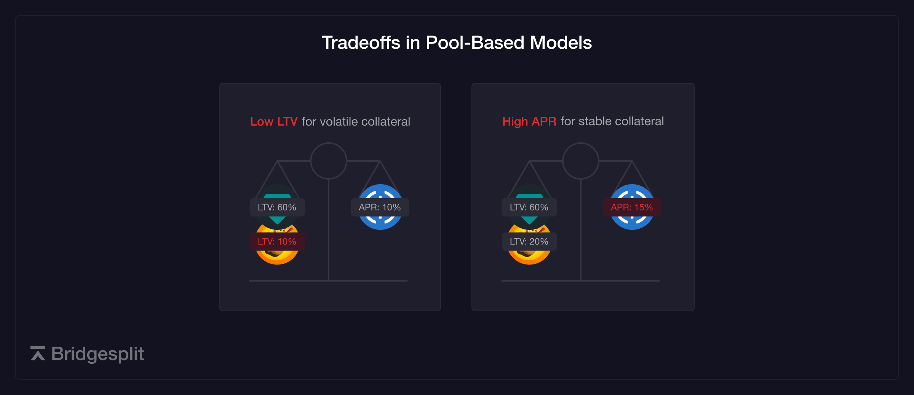

# Why Bridgesplit
The advantages of the Bridgesplit protocol are best understood by explaining how the Limit Creditbook design differs from other lending protocols.

## Better Interest Rates
In the first generation of DeFi lending protocols, the borrowing interest rate is determined by the utilization of the asset. This model is known as a utilization-based or pool-based model. As illustrated in the chart below, when utilization increases, borrowing is discouraged and supplying is encouraged. This design decision was made to maintain excess liquidity for withdrawals.

 However, requiring idle liquidity results in a sub-market interest rate for suppliers. This is because the borrow interest rate is paid only on borrowed assets but distributed across the entire supply, both actively lent and idle. The diagram below illustrates this cash drag caused by the idle liquidity inherent to the pool-based model.
 
 In contrast, a peer-to-peer design matches individual lenders and borrowers based on flexible criteria such as asset type, amount, duration, and interest rate. Lenders and borrowers define the market, transacting at the best rate or with any collateral as long as there is a willing counterparty. With this distinction, capital is *lent* in a peer-to-peer model and *supplied* in a pool-based model.

To illustrate this inefficiency, consider the following example:

### Protocol A (Pool)
1. Lenders supply $100 to the pool.
2. A borrower seeks to borrow $60. The borrow rate is defined as 5% APY for a 60% utilization ratio.
3. Lenders receive 3% APY.

#### Lend APY = Borrow APY $\times$ Borrowed $\div$ Supplied

$\to 5\% \times \text{\textdollar}60 \div \text{\textdollar}100 = 3\% $

### Protocol B (Peer-to-Peer)
1. Lender places offer for $60 at 4% APY.
2. Borrower borrows $60 at 4% APY directly from lender.
3. Both the borrower and lender receive a more favorable rate.

#### Lend APY = Borrow APY

## Collateral Eligibility
Another disadvantage of pooling risk is the limitation on eligible collateral. In a simple loan, we can think about the lender's risk vs. return as a balance between the liquidation risk and the earned APY. The liquidation risk is measurement of how likely the lender will be made whole by the collateral. This likelihood is determined primarily by the LTV and volatility of the collateral asset.

 

Therefore, a higher APY would be required of a borrower borrowing at a higher LTV or against a more volatile asset.
 

In a pool-based model, APY is based on the utilization of the borrowed asset and indpendent of the collateral asset. By pricing risk uniformly across assets, the introduction of volatile or illiquid collateral drives up borrowing costs for all assets. Protocols sacrifice the interests of different borrowers to achieve a market equilibrium.
 

Instead, protocols may limit the assets that may be used as collateral or fragment liquidity by creating multiple pools.

Despite these disadvantages, the pool-based model was designed to address a limitation of peer-to-peer models, where borrowers and lenders must wait for matching counterparties to enter the market when liquidity is insufficient. Bridgesplit introduces the Limit Creditbook (LCB) and virtualized Limit Creditbooks (vLCB) to overcome this limitation without compromising capital efficiency. The LCB allows borrowers and lenders to create orders (requests and offers) with customizable rates, collateral types, and durations. On Bridgesplit's interface, Bridgesplit Markets, the LCB is abstracted to a series of vLCBs, cataloging orders with standardized terms to concentrate liquidity across predefined markets. As more vLCBs are introduced with finer parameterization, short-term liquidity growth is achieved while maintaining long-term flexibility and efficiency. For more information on the Limit Creditbook and other protocol features, refer to the [Protocol Concepts](./protocol-concepts/limit-creditbook.md) page.

## What does the Limit Creditbook accomplish?
1. **Unlock new collateral options**: By segregating collateral risk on a per-loan basis, collateral can include yield-bearing tokens, liquidity provider tokens, liquid staking tokens, and "real-world" assets.
2. **Lending rate = borrowing rate**: Lenders and borrowers access the best available market rates by coordinating directly.
3. **Capital efficiency**: One-to-one lending relationships eliminate the need for unnecessarily idle assets.
4. **Fixed rates**: Fluctuating rates are unsuitable for executing specific investment strategies. Decoupling interest rates from utilization ratios enables fixed rates and other loan structuring functionality. 
5. **Risk management**: In pool-based models, risk is pooled across assets and participants are subject to algorithmic and universal risk management. The Bridgesplit protocol offers unconstrained flexibility in loan structuring, pricing options, and collateral structuring, giving lenders full control over their risk profile.