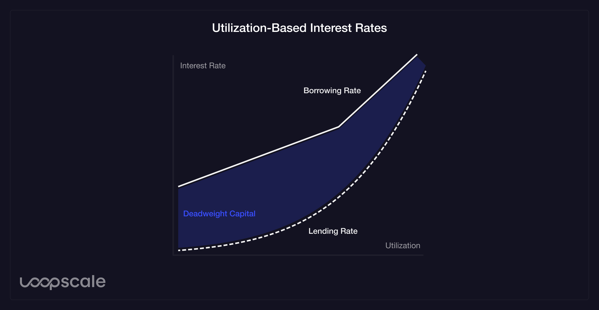
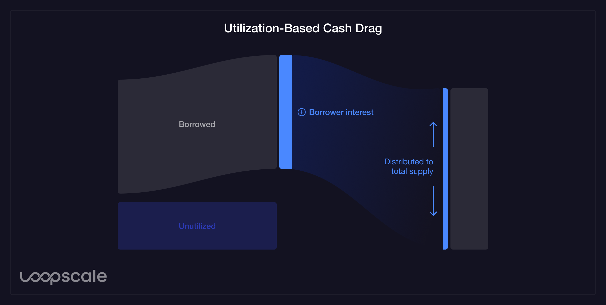
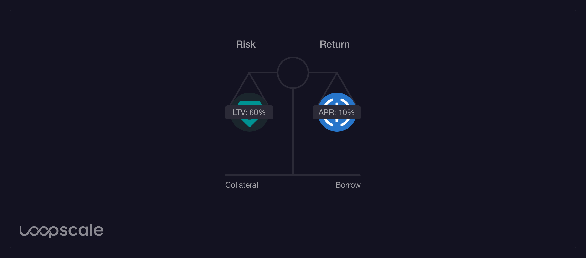
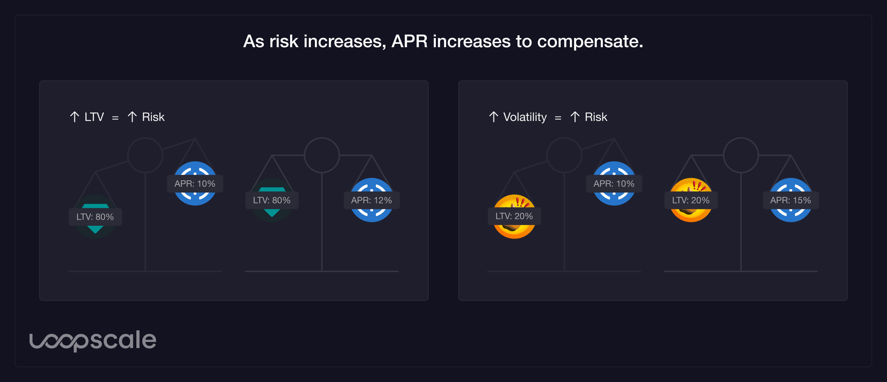
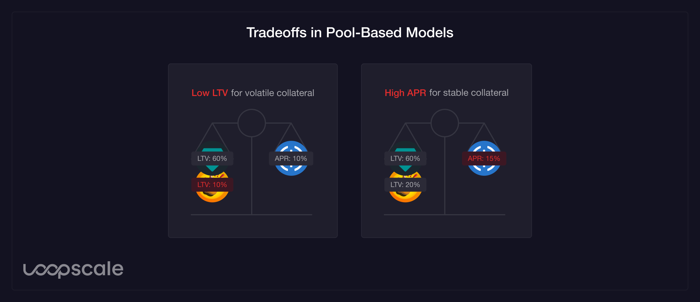

# Why Loopscale?

Before exploring Loopscale's advantages and new primitives, let's understand how traditional, pool-based lending protocols work as well as their limitations.

## The problem with pool-based lending
In the first generation of DeFi lending protocols, the borrowing interest rate is determined by the utilization of the asset. This model is known as a pool- or utilization-based model. As illustrated in the chart below, when utilization increases, borrowing is discouraged and supplying is encouraged. This design decision was made to maintain excess liquidity for withdrawals.

This design creates several fundamental inefficiencies:

1. **Rate spread**: The borrow rate is paid only on borrowed assets but distributed across the entire supply (both active and idle), creating an inherent spread between lending and borrowing rates.

2. **Poor capital utilization**: Pools require excess liquidity for withdrawals, leading to idle capital.

3. **Uniform risk pricing**: Protocol-set rates apply universally regardless of collateral quality. This means borrowing against stable assets (like USDT) costs the same as volatile assets (like SOL).

4. **Limited asset support**: New assets need deep pool liquidity to launch, leaving many novel and emerging assets (like yield-bearing tokens) underserved.

## A better solution: The Credit Order Book
Loopscale's order book model—featuring the Credit Order Book—matches individual lenders and borrowers based on flexible criteria such as asset type, amount, duration, and interest rate. This creates Atomic Markets where:
- Lenders and borrowers define the terms
- Each market has specific parameters and risk pricing
- Any asset can be used as collateral, unlocking potentially trillions in novel and emerging assets

To illustrate the efficiency difference, consider this example:

### Pool-based lending protocol
1. Lenders supply $100 to the pool
2. A borrower borrows $60. The borrow rate is defined by the protocol as 5% APY for a 60% utilization ratio.
3. The protocol sets interest rates:
 - Borrow rate: 5%
 - Lend rate: 3%

The interest rate calculation used here:
$\text{Lend Rate} = \text{Borrow Rate} \times \text{Utilization Ratio}$

$3\% = 5\% \times \frac{60}{100}$

### Loopscale
1. Lender places offer: $60 at 4%
2. Borrower accepts offer: $60 at 4%
3. Direct match means:
   $\text{Lend Rate} = \text{Borrow Rate} = 4\%$

Direct matches via order book bypass the spread between borrow and supply rates found in pool models by instead directly matching parties.

## Reduced rate risk
On Loopscale, loans are direct matches between lender and borrower for a fixed duration. Once a borrower accepts an offer, they lock in a rate for the length of the loan. This enables borrowers to execute more complex or longer-term strategies that are difficult to implement with floating rates.

## Better collateral eligibility
Another disadvantage of pool-based models is the limitation on eligible collateral. In a simple loan, we can think about the lender's risk vs. return as a balance between the liquidation risk and the earned APY. The liquidation risk is measurement of how likely the lender will be made whole by the collateral. This likelihood is determined primarily by the LTV and volatility of the collateral asset.

Therefore, a higher APY would be required of a borrower borrowing at a higher LTV or against a more volatile asset.

In a pool-based model, APY is based on the utilization of the borrowed asset and independent of the collateral asset. By pricing risk uniformly across assets, the introduction of volatile or illiquid collateral drives up borrowing costs for all assets. Protocols sacrifice the interests of different borrowers to achieve a market equilibrium.

Instead, protocols may limit the assets that may be used as collateral or fragment liquidity by creating multiple pools.

Despite these disadvantages, the pool-based model was designed to address a limitation of peer-to-peer models, where borrowers and lenders must wait for matching counterparties to enter the market when liquidity is insufficient. Loopscale addresses these limitations.

## The Credit Order Book and Virtual Markets
On Loopscale's interface, the Credit Order Book is abstracted into virtualized Credit Order Books—collectively called Virtual Markets—which catalog orders with standardized terms to concentrate liquidity across predefined markets. As more Virtual Markets are introduced with finer parameterization, short-term liquidity growth is achieved while maintaining long-term flexibility and efficiency.

## What does the Credit Order Book accomplish?
1. **Market-driven rates**: Lenders set rates per-collateral and per-principal, eliminating the spread between lending and borrowing rates. No more diluted returns from protocol-set algorithmic rates.
2. **Granular risk pricing**: Each market has specific terms, collateral types, and rates. Higher-risk collateral commands higher rates and lower LTVs, while established assets find more competitive terms.
3. **Universal asset support**: New assets don't need deep pool liquidity—just willing counterparties to create a market. This enables immediate support for novel assets, from yield-bearing tokens to emerging cryptocurrencies.
4. **Capital efficiency**: One-to-one lending relationships eliminate unnecessarily idle assets.
5. **Fixed rates and risk control**: Decoupling from utilization ratios enables fixed rates and gives lenders full control over their risk profile through flexible loan structuring.