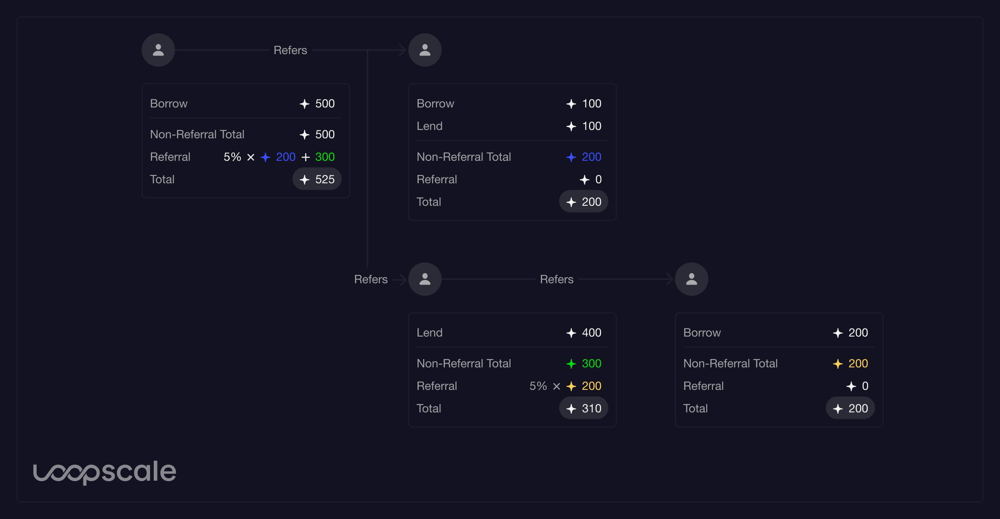

# Earn Points
The Loopscale Rewards program aims to benchmark platform participation by offering targeted, dynamic rewards for key user actions. This list of rewarded actions will evolve over time, introducing and phasing out rewards. The active opportunities as of writing are:
| Action | Rewards |
|:--|:--|
| Create Loopscale account | 100 |
| Accept a user's referral | 50 |
| Join Closed Beta | 500 |
| Follow Loopscale on X | 200 |
| Join Loopscale Discord | 300 |
| Refer a user | Varies |

:::note
Note: The Loopscale Rewards program is subject to change at any time. Allocated rewards may be adjusted due to unforeseen circumstances.
:::

After creating an account, you will see your earned rewards in the navigation bar. Clicking your rewards will take you to a page where you can view your referrals, referral link, and other ways to earn points.

## Referral Points
A user will earn 5% of the non-referral points earned by users they successfully refer. This means that you will earn 5% of all of your referrees' points that they have earned independently of their respective referrees. See the diagram below for an example calculation.

